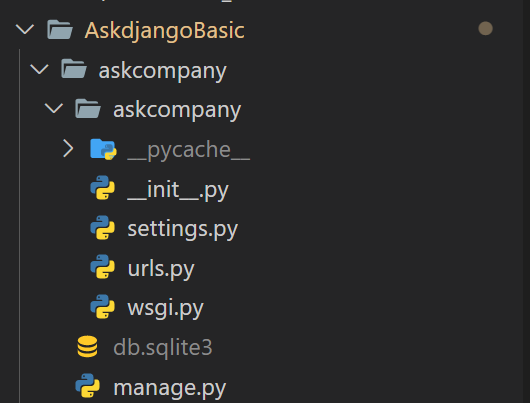

  # 웹 프레임워크 💻

  - 웹 서비스 🖱
    - 서버의 역할! 모든 서비스의 바탕
  
  - 웹 서비스를 만들 때마다 반복되는 것들, 재사용 되는 것들을 표준화 해서 묶어 놓음!

 - 대표적 파이썬 웹 프레임워크 : Django , Flask, Pyramid 등등

 

## Django의 강점

- Python 을 기반으로!  ( 다양한 라이브러리 )
- 풀스택 웹 프레임워크 
- 개발 속도 ⬆

## 설치 과정
- python 필요!
- 가상환경 생성 -> 장고 설치 -> 프로젝트 생성 -> App 생성

 

### Django files  

- 상위 askcompany 폴더 명은 변경해도 괜찮으나 아래 askcompany 폴더 명은 바꾸면 다른 파일들에서도 수정해야하는 경우 발생! (주의✔)
- manage.py : 명령행을 통해 각종 장고 명령 수행
- __init.py__ : 모든 파이썬 패키지에 있는 파일 ( 패키지 임포트 대상)
- settings.py : 장고 기본 설정
- urls.py : 최상위 url 설정
- wsgi.py : 실서비스에서의 웹서비스 진입점

 

### 장고의 주요 기능들
1. Function based View : 함수로 이루어져 있으며 ( 호출 가능한 객체 ) HTTP 요청을 처리함.
2. Models : 데이터베이스와의 인터페이스
3. Templates: 주로 HTML , 복잡한 문자열 조합을 용이하게 함 
4. Admin : 데이터베이스 레코드를 관리할 수 있는 간단한 UI
5. Logging : 다양한 경로로 메세지 로깅 (기록)
6. Static files: 개발 목적의 정적 파일 관리
7. Message Framework : 유저에게 1회성 메세지 노출 목적
8. Class Based Views : 클래스로 함수 기반 뷰 생성
9. Form : 입력폼 제공 , 유효성 검사 등등
10. Testing
11. 국제화 & 지역화 : 화폐통화, 단위 등등 지역에 맞춰 제공
12. 캐싱
13. Geographic : db에 의존적이긴 하지만 제공
14. Sending Email
15. Syndication Feeds
16. Sitemaps

 

### 장고의 기본 구조

- 출처 : https://www.askcompany.kr/
