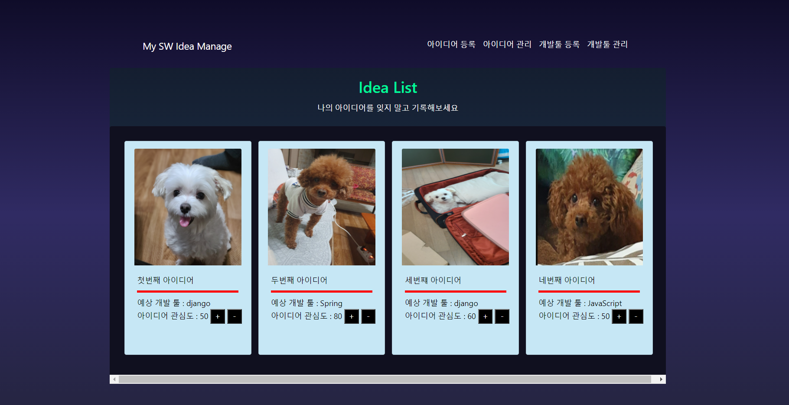
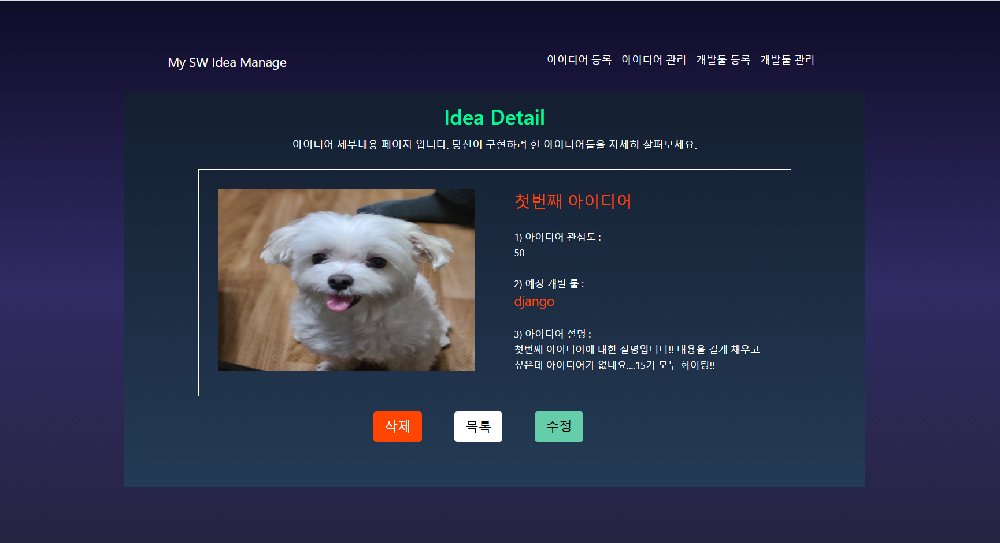
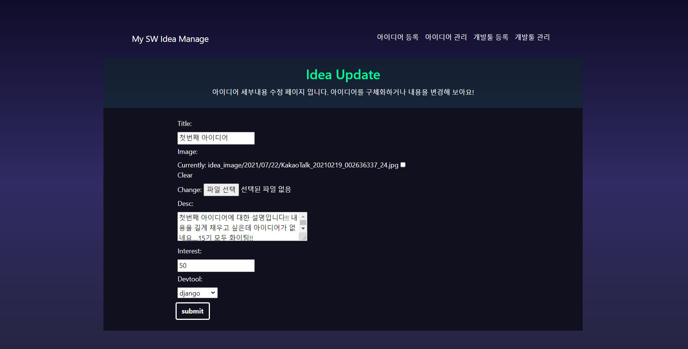
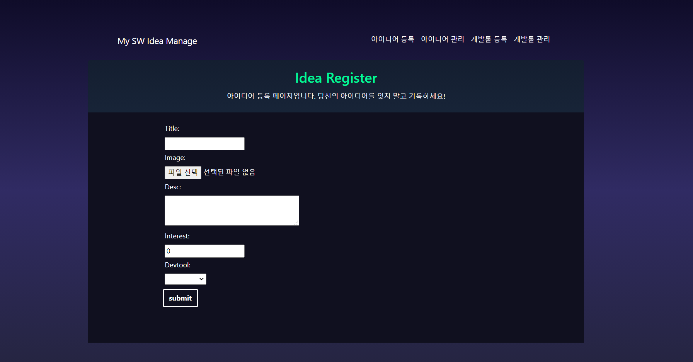
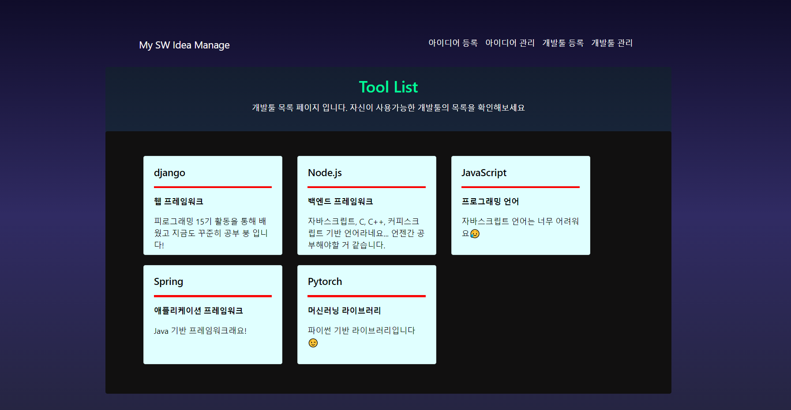
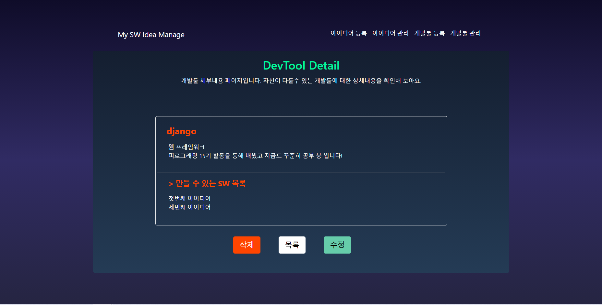
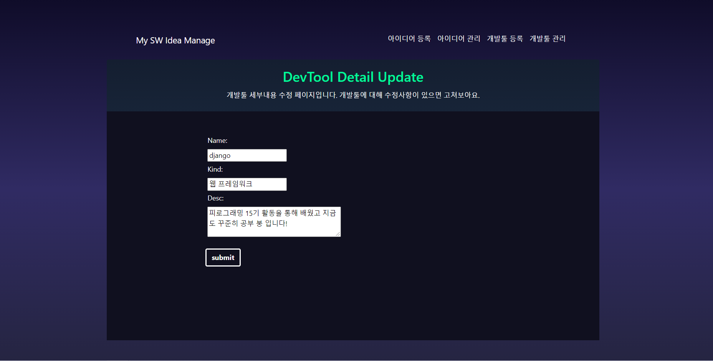
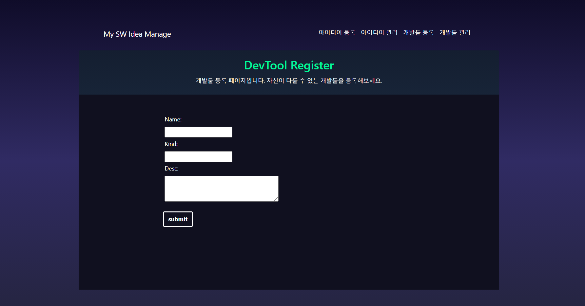

### SWIDEA 사이트 과제 (Django)

구현한 기능
``` 
기능 : 1,2,3,4,5,6,7,8,9,10,11,12
```

구현 못 한 기능
``` 
없음
```

### SWIDEA 사이트 결과창

####  아이디어 

- 아이디어 관리


- 아이디어 상세


- 아이디어 수정


- 아이디어 등록


#### 개발툴

- 개발툴 관리


- 개발툴 상세


- 개발툴 수정


- 개발툴 등록

